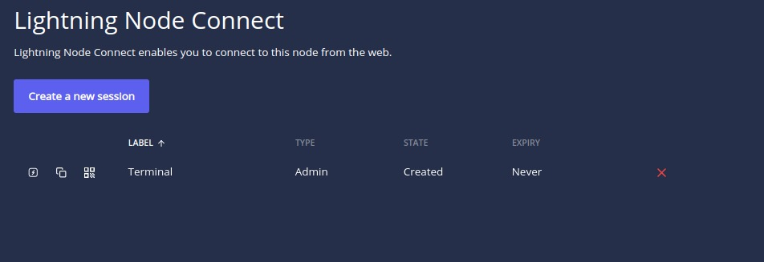

# lit-lnd-docker
Docker configuration to run Lightning Terminal with LND in testnet

Done using https://github.com/nostrassets/taproot-docker/tree/main/testnet as starting point

Create .env file with following content:

```
# LND
ALIAS=your_alias
# Lightning Terminal
UIPASSWORD=litui-password-here
```

Run ``docker-compose up``

Open Lightning terminal at ``https://localhost:8444``

Create ``Lightning Node Connect`` sessions to use https://terminal.lightning.engineering/ and import in Alby extension (LNC)

* Accessing Lightning Terminal


*Figure1: Lightning Node Connect page*


*Figure2: Creating admin session to be used at https://terminal.lightning.engineering/*


*Figure3: LNC Session created, copy access pairing phrase*


*Figure4: Paste access pairing phrase*


*Figure5: Node connected to lightning terminal UI*

    * Accessing Alby


*Figure6: Creating custom LNC session for alby usage*


*Figure7: Setting permissions*


*Figure8: Alby connect wallet main page, select "Bring Your Own Wallet"*


*Figure8: Select Lightning Terminal (LNC)*


*Figure9: Paste pairing phrase generated for alby usage*


*Figure10: Alby connected to node*